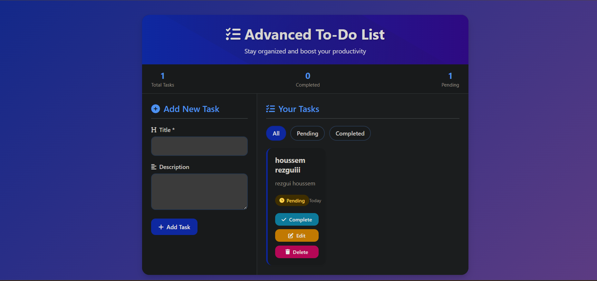
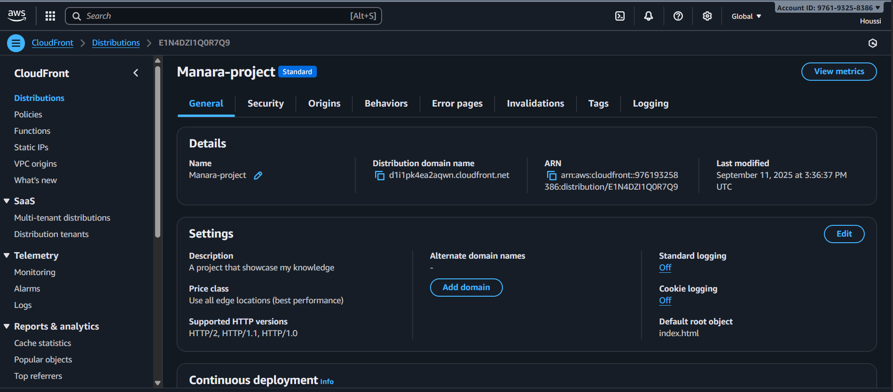
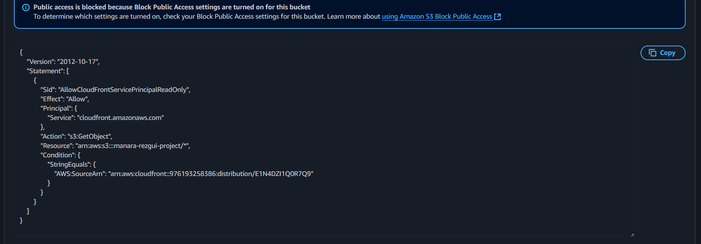
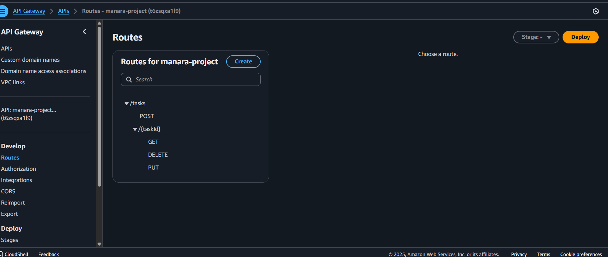
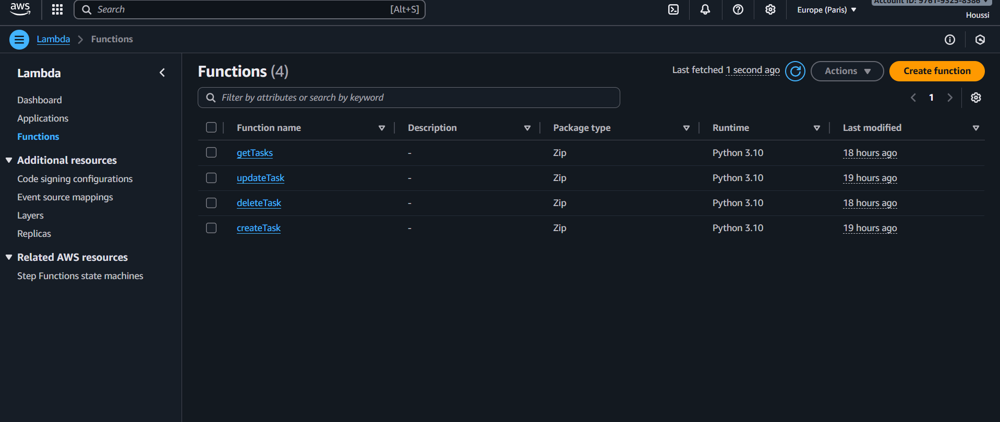
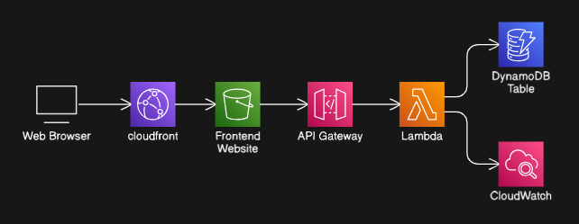

To-Do List App - Complete Showcase
 Application Overview
A modern, responsive To-Do List application built with a serverless architecture on AWS. 
This application demonstrates a complete full-stack implementation with seamless integration between frontend and backend services.

##Frontend UI

Purpose: Provide the user interface for the To-Do List application.

Setup:

Built as a single file containing:

HTML → Structure of the app (buttons, input, task list).

CSS → Styling for a clean and responsive UI.

JavaScript → Logic for CRUD operations and API calls.

Connected to API Gateway to perform backend operations (create, read, update, delete tasks).

Designed for static hosting on S3

##CloudFront

Purpose: Distribute the frontend securely and efficiently.

Setup:

Created a CloudFront distribution pointing to the S3 bucket (frontend storage).

Set caching to 30 seconds to refresh content frequently.

Configured default root object as index.html.

Enabled HTTP versions: 1.0 and 2.1.

Fixed origin name and behavior settings.

Security: Configured permissions so CloudFront can read from the S3 bucket.

##S3 Bucket (Frontend Storage)

Purpose: Store static frontend files (HTML, CSS, JavaScript).

Setup:

Blocked public internet access.

Uploaded the frontend file, which contains HTML, CSS, and JavaScript logic for the To-Do List.

Configured permissions so CloudFront can access the content.

##API Gateway (Backend API)

Purpose: Handle frontend requests and connect to Lambda functions.

Setup:

Created an HTTP API.

Added Lambda integrations for CRUD operations (createTask, getTask, updateTask, deleteTask).

Enabled CORS:

Allowed origin: * (everyone)

Allowed headers: Content-Type, Authorization

##Lambda Functions

Purpose: Execute backend logic for CRUD operations.

Setup:

Written in Python:

createTask → Create a new task

getTask → Retrieve tasks

updateTask → Update an existing task

deleteTask → Remove a task

Uploaded each function as a separate .zip file to Lambda.

Configured handlers correctly for API Gateway integration.

Tested each function independently and then tested end-to-end with frontend.

##End-to-End Flow

User accesses the frontend via CloudFront.

Frontend makes API requests to API Gateway.

API Gateway triggers the corresponding Lambda function.

Lambda interacts with DynamoDB (if used) to perform CRUD operations.

Results are sent back to the frontend and displayed to the user.

